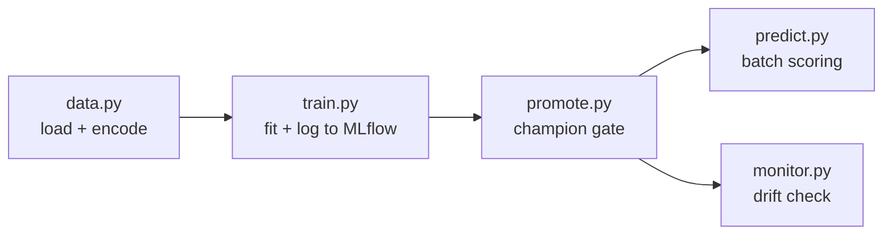

# Churn Prediction MLOps

Telco customers cancel their contracts. This predicts which ones are about to,
so the retention team can call them before they go rather than after.

The model isn't the interesting part - it's a gradient boosting classifier and
it takes ten lines. What this repo is really about is everything around it:
tracking experiments, deciding when a new model is good enough to replace the
old one, scoring customers with it, packaging it, and noticing when it starts
to go stale.

## The data

IBM's Telco churn dataset - 7,032 customers, 19 features (contract type,
tenure, monthly charges, which services they subscribe to), and whether they
churned. About 27% did.

It's committed to the repo. That's deliberate: it's small and public, so anyone
can clone this and run it offline. In a real project the data would live in a
warehouse or object store with DVC on top, not in git.

## How it fits together



`train.py` fits a model and logs it to MLflow, which keeps every run's metrics
and registers each model as a new version.

`promote.py` decides whether that new version replaces the current champion. It
only promotes if the model clears an ROC-AUC floor of 0.75 *and* beats whatever
is currently champion. This is separate from training on purpose - training
produces candidates, promotion is a decision.

`predict.py` loads whatever is currently tagged `@champion` and scores
customers. It never names a version number, so promoting a better model changes
what gets served without touching this file.

`monitor.py` runs a Kolmogorov-Smirnov test on the numeric features to check
whether new data still resembles what the model trained on. If it doesn't, the
model is quietly getting worse and it's time to retrain.

## Running it

```bash
git clone https://github.com/rcitius/churn-prediction-mlops
cd churn-prediction-mlops
python -m venv .venv && source .venv/bin/activate
pip install -r requirements.txt
```

Then, from the repo root:

```bash
python -m src.train      # train and register a model
python -m src.promote    # promote it if it's good enough
python -m src.predict    # score five customers
python -m src.monitor    # check for drift
```

Run everything from the repo root - MLflow writes to a relative
`sqlite:///mlflow.db`, so running from a subdirectory quietly creates a second,
empty database.

To see the runs and registered models:

```bash
mlflow ui --backend-store-uri sqlite:///mlflow.db
```

## Why ROC-AUC and not accuracy

73% of these customers don't churn, so a model that predicts "nobody churns"
scores 73% accuracy and is worthless. ROC-AUC measures whether the model ranks
the actual churners above the non-churners, which is what a retention team
needs - a list to work through, in priority order.

## Tests and CI

Two tests, both catching things that fail silently rather than loudly: that the
target hasn't leaked into the features, and that the model still clears an AUC
floor. GitHub Actions runs them on every push.

A second workflow builds the Docker image and pushes it to GHCR. The image
carries the code, not the model - it pulls `@champion` from the registry at
runtime, so a newly promoted model is picked up without a rebuild.

## Things I'd do differently at scale

- One-hot encoding via `pd.get_dummies` is fine here but doesn't survive contact
  with production, where a category unseen at training time silently changes the
  column set. A fitted encoder saved with the model fixes that.
- Drift detection is a hand-rolled KS test on three numeric columns. Evidently
  or a platform model monitor would cover categorical features and alerting too.
- The MLflow backend is a local SQLite file. A shared team setup needs a
  tracking server with Postgres and blob storage.
